# Simon Game 

## Description

Simon Game is a classic memory game where players need to repeat a sequence of colors and sounds in the correct order. The sequence gets progressively longer and more complex, challenging the player's memory and attention.

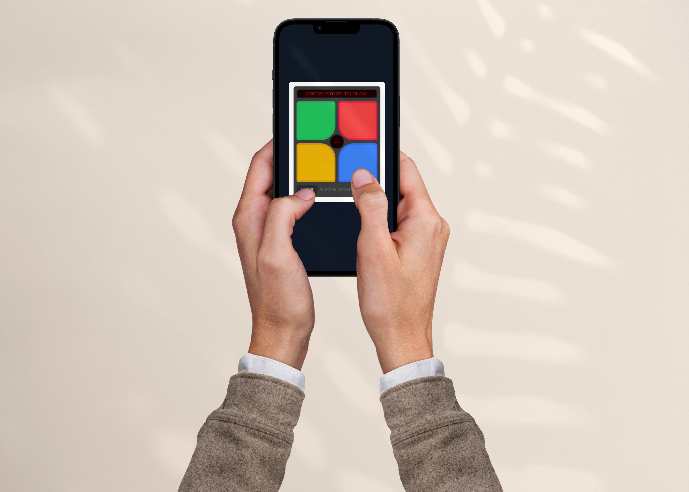


You can visit the live website [here!](https://simon-game-pp2-ci.netlify.app/)

## User Experience

### Project Goals

- Provide an engaging and interactive game that challenges the memory of the player.
- Offer a visually appealing and responsive design suitable for both desktop and mobile users.
- Ensure a seamless and intuitive user interface.

### Target Audience

- Casual gamers looking for a fun and simple game to play.
- Individuals seeking to improve their memory and cognitive skills.
- Fans of classic electronic games.

## **Design**

### **Colours**

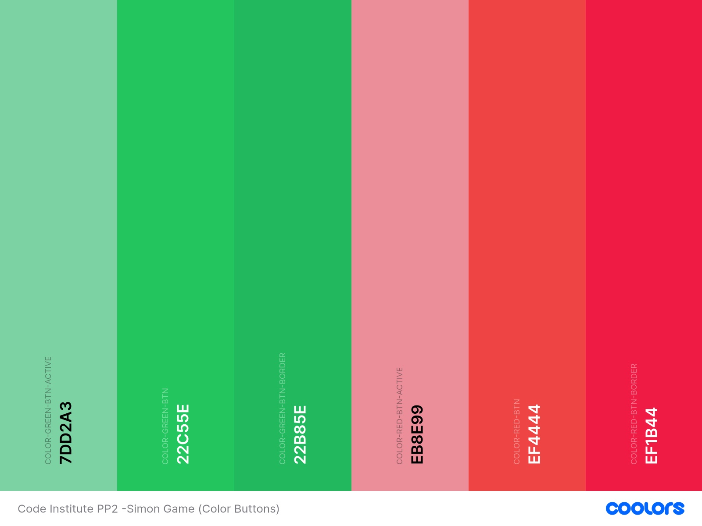
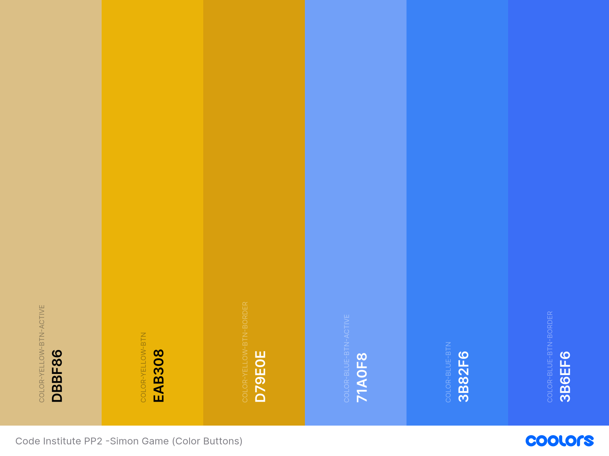
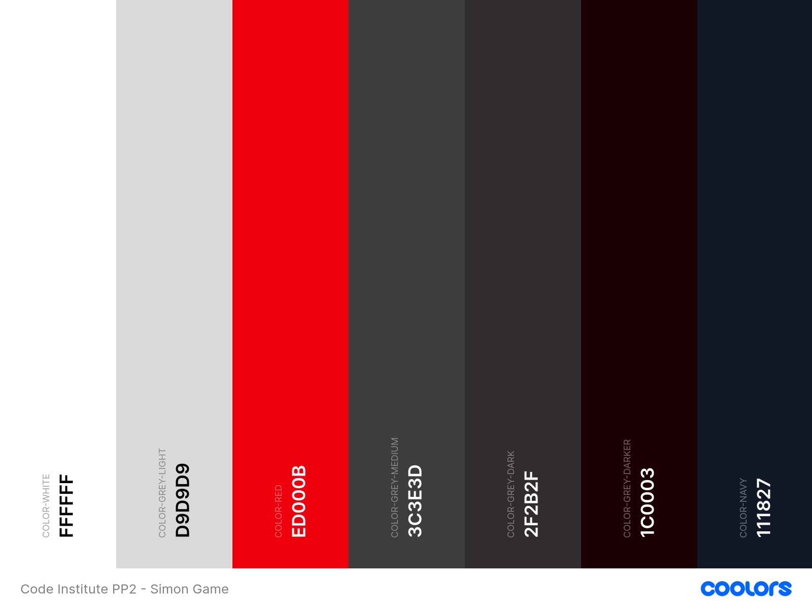

### **Typography**
- All icons were sourced through [Iconify](https://www.figma.com/community/plugin/735098390272716381/iconify) Figma plugin
- All fonts were sourced through [Google Fonts](https://fonts.google.com/)
- [Roboto](https://fonts.google.com/specimen/Roboto)
- [Orbitron](https://fonts.google.com/specimen/Orbitronr)

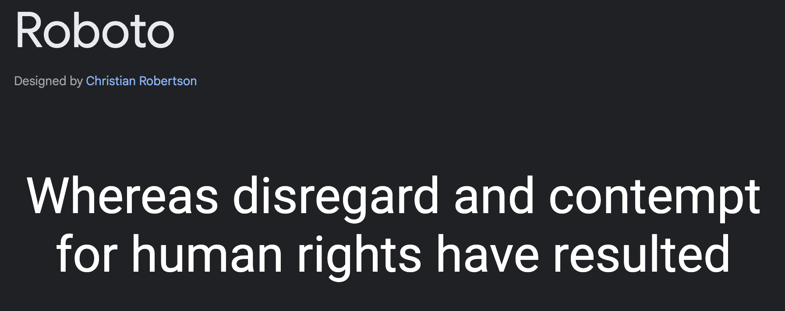
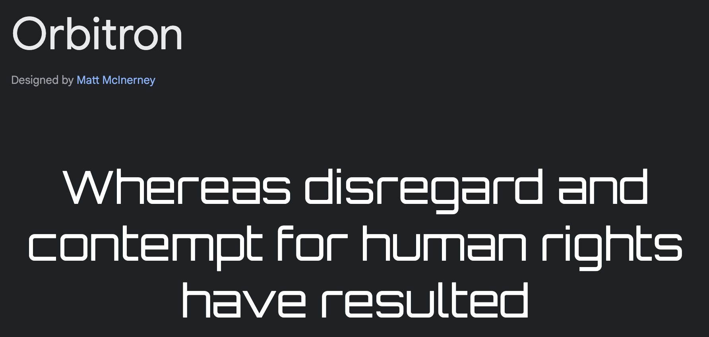

### **Wireframe and Prototype**

### [Balsamiq](https://balsamiq.com/) wireframe:

<details>
<summary> Open for desktop wireframe </summary>

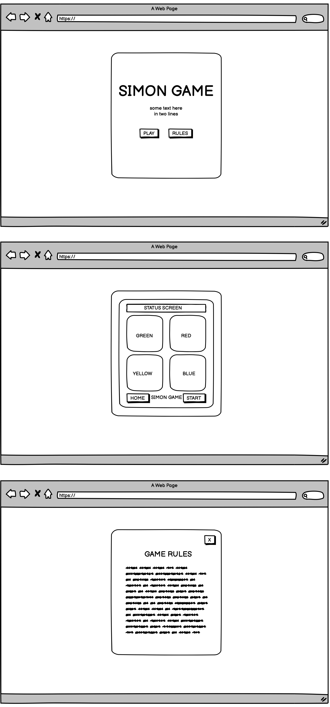

</details>

<details>
<summary> Open for mobile wireframe </summary>

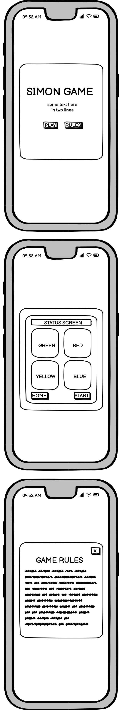

</details>

### [Figma](https://www.figma.com/) prototype:

<details>
<summary> Open for desktop prototype </summary>

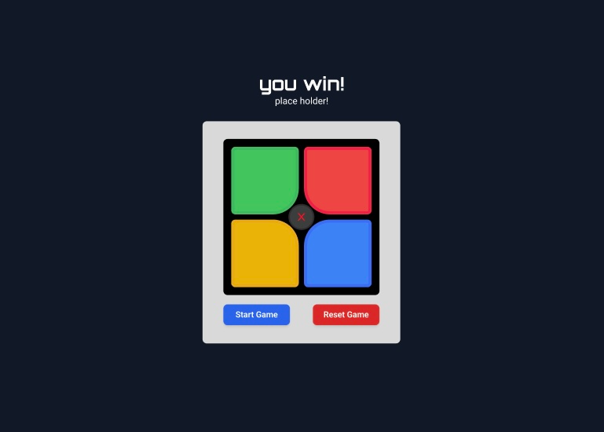

</details>

## Features

### **Meta Tags and Optimization**

The <head> section of the Simon Game website includes essential meta tags for SEO and social media sharing. The meta description provides a summary for search engines, while the keywords tag helps search engines understand the site content. The Open Graph URL tag defines the canonical URL for social media, and the author tag credits Tulio Minini. The Open Graph title and image tags set the title and image for social media sharing, ensuring the content is attractive and informative when shared on platforms like Facebook and Twitter.

### **Home Screen**

The Home Screen serves as the main entry point for the application. It features a "Play" button to navigate users to the Game screen and a "Rules" button that navigates users to the Rules Screen. The layout includes introductory elements and the game title, providing users with an engaging and accessible start to their experience.

| Desktop                                                                           | Mobile                                                                          |
| --------------------------------------------------------------------------------- | ------------------------------------------------------------------------------- |
| 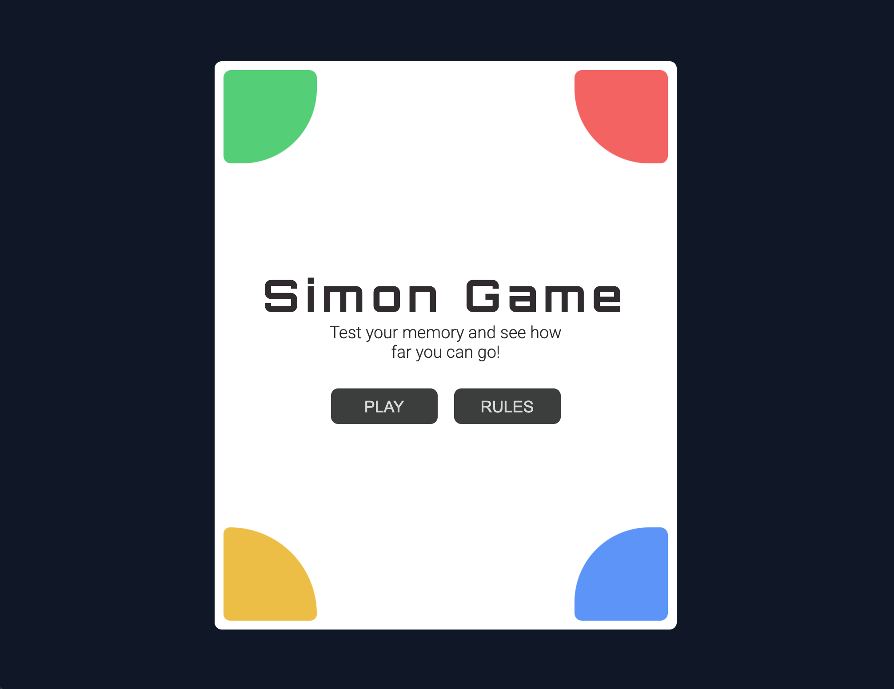 | 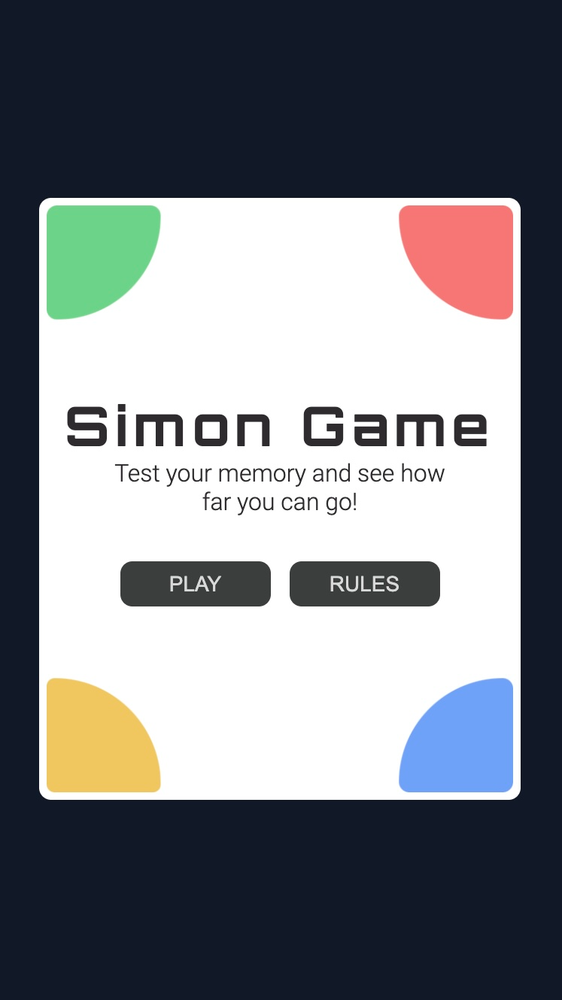 |

### **Rules Screen**

The Rules Screen offers clear instructions and guidelines for playing the game. It provides detailed explanations of the game rules and objectives, ensuring users understand how to play. The screen includes a "Close" button for easy navigation back to the Home Screen, and the layout is designed for readability and straightforward understanding.

| Desktop                                                                            | Mobile                                                                           |
| ---------------------------------------------------------------------------------- | -------------------------------------------------------------------------------- |
| 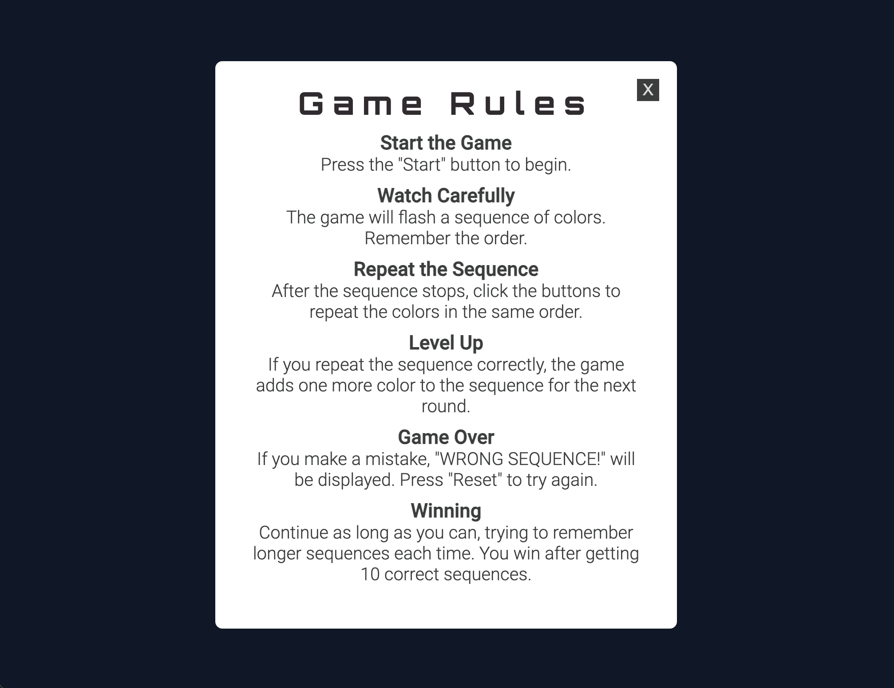 | 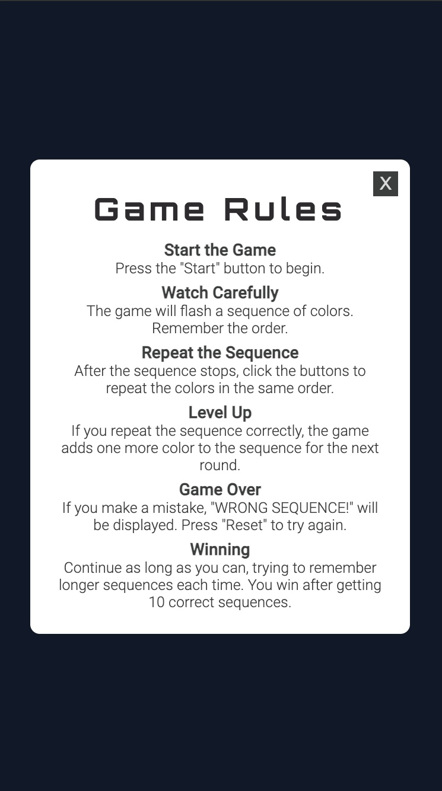 |

### **Game Screen**

The Game Screen is where the actual gameplay takes place. It includes interactive color buttons (green, red, yellow, blue) that players use to engage with the game. The screen displays the current game status and level, features a "Start" button to start, and "Reset" button for restarting the game, and includes sound controls to toggle game sounds on or off. Visual feedback is provided for user actions, including animations for correct and incorrect inputs, enhancing the overall gaming experience.

| Desktop                                                                           | Mobile                                                                          |
| --------------------------------------------------------------------------------- | ------------------------------------------------------------------------------- |
| 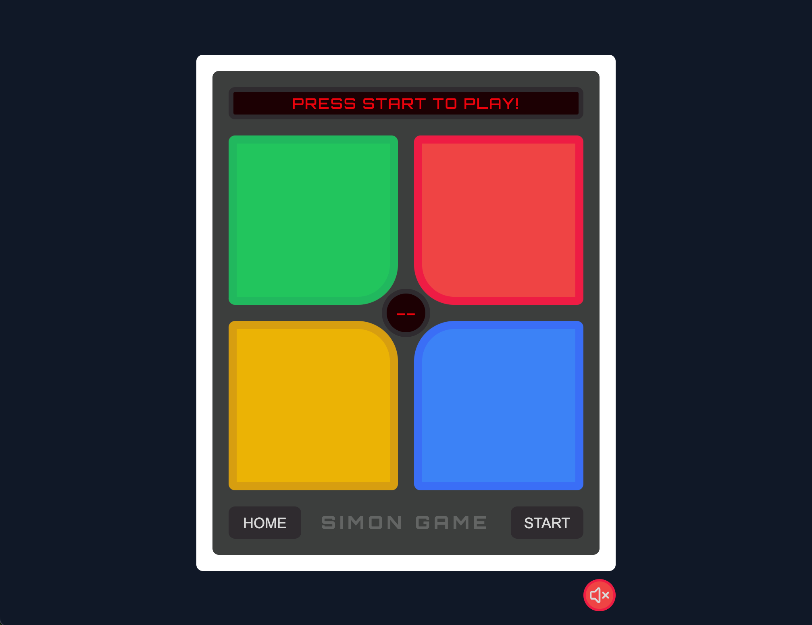 | 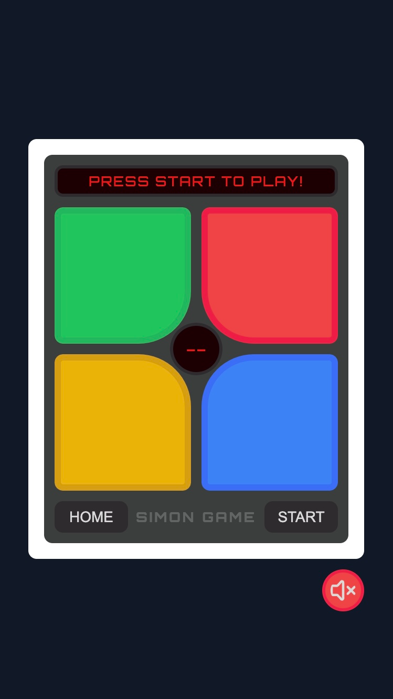 |

## BEM Methodology

BEM (Block, Element, Modifier) is a popular naming convention for classes in HTML and CSS, originally developed by Yandex. It is designed to create reusable, modular, and maintainable code.

### BEM Structure

BEM divides the user interface into independent blocks, which can be reused across different parts of the application. The naming convention follows a specific structure:

- **Block**: The top-level component or a standalone entity that is meaningful on its own.
  - Example: `header`, `container`, `menu`
- **Element**: A part of a block that performs a certain function and has no standalone meaning.
  - Example: `header__title`, `menu__item`
- **Modifier**: A flag on a block or an element that changes its appearance or behavior.
  - Example: `menu__item--active`, `header--large`

### Naming Convention

The BEM naming convention uses a double underscore (`__`) to separate elements from their block and a double hyphen (`--`) to separate modifiers from blocks or elements.

- **Block**: `block-name`
- **Element**: `block-name__element-name`
- **Modifier**: `block-name--modifier-name` or `block-name__element-name--modifier-name`

### Example

```html
<div class="menu">
  <ul class="menu__list">
    <li class="menu__item menu__item--active">Home</li>
    <li class="menu__item">About</li>
    <li class="menu__item">Contact</li>
  </ul>
</div>
```

In this example:

- `menu` is the block.
- `menu__list` and `menu__item` are elements of the menu block.
- `menu__item--active` is a modifier that changes the appearance of the `menu__item` element.

### Benefits of BEM

1. **Clarity and Readability:** BEM makes it clear what each class refers to by looking at its name. It is easy to identify whether a class represents a block, an element, or a modifier.

2. **Modularity:** BEM promotes the creation of independent components. Each block is standalone, making it easier to reuse and maintain.

3. **Avoids Naming Conflicts:** The structured naming convention helps avoid class name conflicts, which are common in larger projects with many contributors.

4. **Improved Maintainability:** With BEM, the CSS and HTML structure is more organized, making it easier to understand, debug, and modify the code.

5. **Enhanced Scalability**: BEM's approach is particularly useful for large projects as it provides a consistent methodology for naming and structuring classes.

6. **Better Collaboration:** The clarity and structure provided by BEM make it easier for multiple developers to work on the same project without confusion.

## Sass

Sass (Syntactically Awesome Style Sheets) is a CSS pre-processor that adds power and elegance to the basic language. It allows for variables, nested rules, mixins, functions, and more, helping to keep large stylesheets well-organized and easier to maintain.

### Benefits of Sass

1. **Variables:** Store colors, fonts, or any CSS value in variables for easy reuse and management.
2. **Nesting:** Allows for a cleaner and more readable hierarchy of styles.
3. **Partials:** Break down CSS into smaller, reusable files.
4. **Mixins:** Create reusable chunks of code to avoid redundancy.
5. **Inheritance:** Share a set of CSS properties from one selector to another.
6. **Built-in Functions:** Provides functions for manipulating colors, math operations, and more.

### Reasons for Choosing Sass for this Project

In my current internship, I am learning to use Sass as part of my development toolkit. Recognizing the value of this pre-processor in professional projects, I decided to incorporate Sass into my code institute project to practice and reinforce my skills. By applying Sass in this project, I am gaining hands-on experience with its features and best practices, which not only enhances the maintainability and scalability of my code but also aligns with industry standards. This approach allows me to leverage my learning from the internship and integrate it into practical applications, ultimately improving both my technical proficiency and the quality of my project.

## Testing

Responsiveness has been checked and adjusted in Chrome Dev Tools and the site has been viewed on mobiles and desktop without issues and the following browsers:

- Chrome

- Safari

- Firefox

### **JSHint Validation**

The JavaScript code has been run through the [JS HInt](https://jshint.com/) validator. Results can be found below.

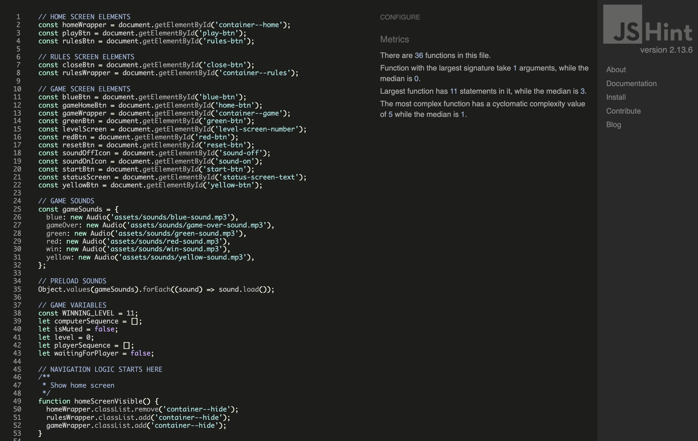

### **HTML Validation**

The HTML code has been run through the [W3C - HTML](https://validator.w3.org/) validator. Results can be found below.

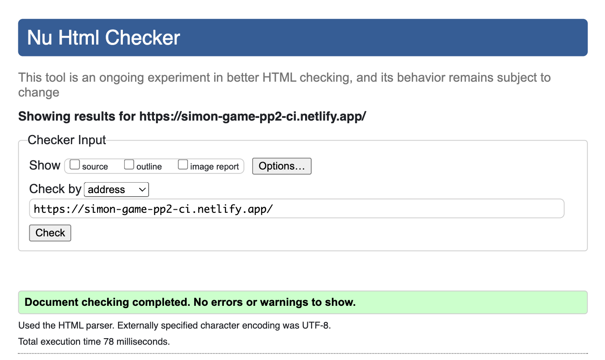

### **CSS Validation**

The CSS code has been run through the [W3C - CSS](https://jigsaw.w3.org/css-validator/) validator. Results can be found below.
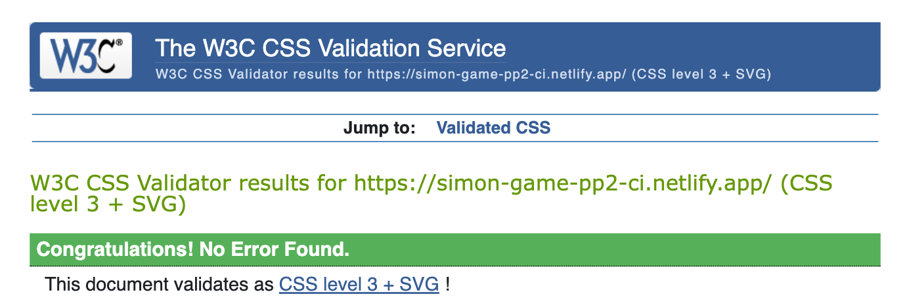

### **Google Lighthouse**

The lighthouse score results can be found below.

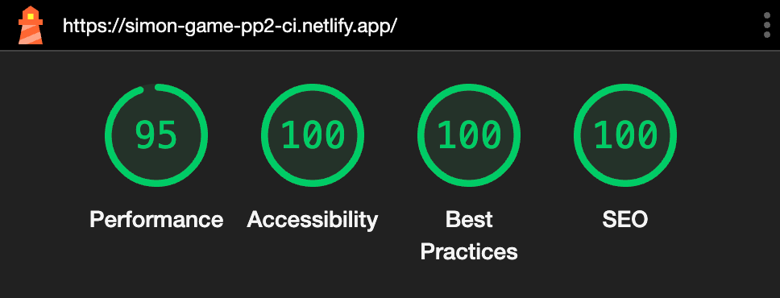

### **WAVE Accessibility Evaluation**

The WAVE accessibility evaluation tool results can be found below.

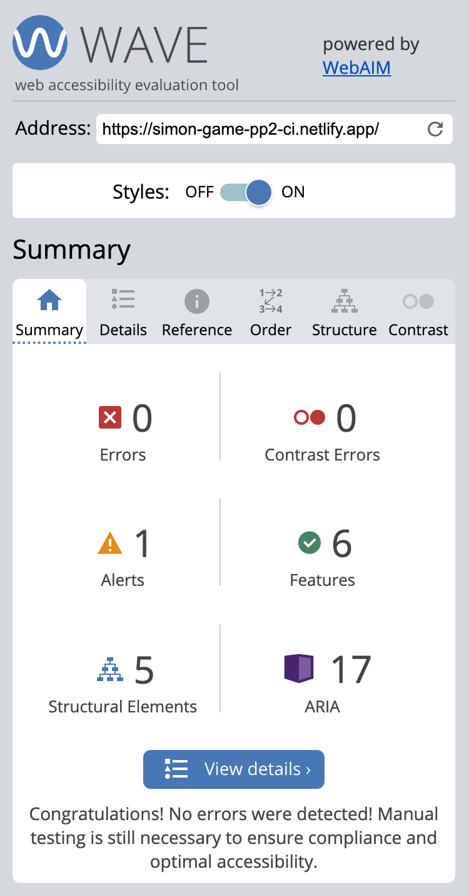

### **Manual Testing**

| Features                   | Expected Outcome                                                            | Test Performed                                             | Results                                                                                      | Pass/Fail |
| -------------------------- | --------------------------------------------------------------------------- | ---------------------------------------------------------- | -------------------------------------------------------------------------------------------- | --------- |
| **Home Screen**            |
| Play Button                | Navigates to the game screen                                                | Clicked "Play" button                                      | Successfully navigated to the game screen                                                    | Pass      |
| Rules Button               | Navigates to the rules screen                                               | Clicked "Rules" button                                     | Successfully navigated to the rules screen                                                   | Pass      |
| **Rules Screen**           |
| Close Button               | Returns to the home screen                                                  | Clicked "Close" button                                     | Successfully navigated back to the home screen                                               | Pass      |
| **Game Screen**            |
| Color Buttons              | Plays corresponding sound and flashes button                                | Clicked on each color button                               | Each button played the correct sound and flashed                                             | Pass      |
| Start Button               | Starts the game and begins the sequence                                     | Clicked "Start" button                                     | Game sequence began and progressed as expected                                               | Pass      |
| Reset Button               | Resets the game to its initial state                                        | Clicked "Reset" button                                     | Game reset to initial state and cleared sequences                                            | Pass      |
| Mute Button                | Toggles sound on/off for game sounds                                        | Clicked "Mute" button                                      | Sound toggled on and off as expected                                                         | Pass      |
| Sound Icons                | Display correct icon based on sound state                                   | Checked the sound icons                                    | Icons correctly displayed based on sound state                                               | Pass      |
| Status Screen              | Displays correct status messages                                            | Verified status messages during game events                | Status messages updated correctly                                                            | Pass      |
| Level Screen               | Shows current level or status of the game                                   | Checked level display during gameplay                      | Level displayed correctly and updated during play                                            | Pass      |
| Navigation Between Screens | Smooth transition between screens                                           | Navigated between Home, Rules, and Game screens            | Transitions between screens were smooth and correct                                          | Pass      |
| Winning                    | Displays win message, flashes buttons, and updates screen accordingly       | Completed game with correct sequence                       | Win message displayed, buttons flashed, game status updated, and reset options enabled       | Pass      |
| Game Over                  | Displays game over message, flashes buttons, and updates screen accordingly | Made an incorrect move                                     | Game over message displayed, buttons flashed, game status updated, and reset options enabled | Pass      |
| **Footer**                 |
| Footer Link to GitHub      | The footer contains a link that opens the GitHub repository in a new tab.   | Check the footer section of the page and inspect the link. | The link is present and correctly opens in a new tab.                                        | Pass      |

### **Bugs**

### 1. Game Behaving Unexpectedly After Multiple Clicks in the Color Buttons

**Description:**  
After the first round, if a player clicks a color button multiple times, the game ends as expected but also resets automatically without prompting the player to manually reset. This disrupts the game flow by not giving the player an opportunity to restart the game at their convenience.

**Steps to Reproduce:**

1. Start a new game and complete the first round.
2. During the subsequent rounds, repeatedly click any color button rapidly.
3. Observe that the game ends correctly but resets automatically without prompting the player.

**Expected Behavior:**
The game should end with the "game over" message if the player makes an incorrect move.
The game should prompt the player to manually reset or provide an option to restart rather than resetting automatically.

**Actual Behavior:**
When multiple clicks are detected, the game ends correctly but immediately resets to the initial state without giving the player a chance to take any action or see the "game over" message for a reasonable time.

**Solution:**
Update the handleColorClick function to include a condition that prevents any action if the game is in the "game over" state. This way, multiple clicks after the game ends will not trigger unintended behavior.

Before:

```javascript
function handleColorClick(color) {
  if (!waitingForPlayer) return;

  playerSequence.push(color);
  playSound(color);
  flashButton(color);

  if (
    playerSequence[playerSequence.length - 1] !==
    computerSequence[playerSequence.length - 1]
  ) {
    gameOver();
    return;
  }

  if (playerSequence.length === computerSequence.length) {
    levelScreen.textContent = 'OK';
    setTimeout(nextLevel, 1000);
  }
}
```

After:

```javascript
function handleColorClick(color) {
  if (!waitingForPlayer) return;

  // solution here
  if (playerSequence.length >= computerSequence.length) return;

  playerSequence.push(color);
  playSound(color);
  flashButton(color);

  if (
    playerSequence[playerSequence.length - 1] !==
    computerSequence[playerSequence.length - 1]
  ) {
    gameOver();
    return;
  }

  if (playerSequence.length === computerSequence.length) {
    levelScreen.textContent = 'OK';
    setTimeout(nextLevel, 1000);
  }
}
```

### **Test Final Review**

The testing procedures have been executed, meeting all specified criteria. Results have been thoroughly documented, and any identified issues have been addressed. Post-testing, the website has been confirmed to be fully functional and accessible.

## Tech Stack

This website is developed using the following technologies:

**HTML**: For structuring the content and layout of the web pages.

**CSS**: For styling the website and making it visually appealing.

**SASS**: A CSS pre-processor for writing more maintainable and scalable stylesheets.

**JavaScript**: For adding interactivity and dynamic features to the website.

## Tools Used

This website is developed using the following tools:

**GitHub**: Used for version control and code storage. GitHub allows for collaborative development, issue tracking, and code review, ensuring a smooth workflow and version management.

**Netlify**: Used to deploy the website. Netlify offers seamless continuous deployment and provides a range of features such as form handling, serverless functions, and a global CDN for fast content delivery.

**VS Code**: Integrated Development Environment (IDE) used to write, edit, and debug code. VS Code supports numerous extensions that enhance productivity, such as Git integration, syntax highlighting, and linting tools.

**Google DevTools**: A set of web developer tools built directly into the Google Chrome browser. Google DevTools provides features for debugging, editing CSS and HTML on the fly, and analyzing website performance.

**Google Fonts**: A library of over a thousand free and open-source font families. Google Fonts ensures consistent and aesthetically pleasing typography across different browsers and devices.

**Figma**: A web-based design tool used for creating user interfaces and prototyping. Figma enables real-time collaboration, making it easy to gather feedback and iterate on design ideas.

**Balsamiq**: A wireframing tool used to create low-fidelity mockups. Balsamiq helps in quickly visualizing the structure and layout of web pages before moving on to high-fidelity design.

**W3C Markup Validation Service**: A tool provided by the World Wide Web Consortium (W3C) to validate HTML and XHTML documents. This service checks for errors in the markup to ensure compliance with web standards.

**W3C CSS Validation Service**: A tool provided by W3C to validate CSS code. It helps in identifying errors and potential issues in the stylesheet, ensuring it adheres to CSS standards.

**WAVE Accessibility**: A web accessibility evaluation tool. WAVE helps in identifying accessibility issues on web pages, ensuring they are accessible to users with disabilities.

**Google Lighthouse**: An open-source, automated tool for improving the quality of web pages. Lighthouse audits performance, accessibility, SEO, and other best practices, providing insights and recommendations for improvement.

**Prettier**: A code formatter that enforces a consistent style by parsing your code and re-printing it with its rules. Prettier helps maintain clean and readable code throughout the project.

**Birme**: An online bulk image resizing tool. Birme is used to resize images quickly and efficiently, ensuring that they are optimized for the web without compromising on quality.

**LinkedIn Post Inspector**: Post Inspector can help you identify the data missing on your page, and what you need to add for your content to have better previews in posts.

**Favicon.io**: A tool that simplifies the creation of website favicons, allowing users to easily generate icons that represent their brand across different platforms and devices.

**pixabay.com/**: A popular online resource for free high-quality sounds.

Each of these tools plays a crucial role in the development, deployment, and maintenance of the website, contributing to its overall quality and user experience.

## Deployment

_This website is deployed using Netlify._

### Steps

1. **Log in to Netlify:** Navigate to the [Netlify website](https://www.netlify.com/) and log in to your account.

2. **Create New Site:** Once logged in, click on the "New site from Git" button.

3. **Connect to GitHub:** Choose GitHub as your Git provider and authorize Netlify to access your repositories.

4. **Select Repository:** Select the repository for your website, in this case, "The Force Awaken."

5. **Configure Settings:** Netlify will automatically detect your build settings, but you may need to adjust them if necessary.

6. **Deploy Site:** Once configured, click on the "Deploy site" button. Netlify will start building and deploying your site automatically.

7. **Live Site:** After the deployment process is complete, Netlify will provide you with a unique URL for your live site. You can access your live site by visiting this URL.

## How to Fork and Clone the Repository and Install Packages

1. **Fork the Repository:**

- Go to the GitHub repository.
- Click the "Fork" button in the top-right corner of the page.
- This will create a copy of the repository in your GitHub account.

2. **Clone the Repository:**

   ```sh
   git clone https://github.com/yourusername/your-repository.git
   cd your-repository
   ```

3. **Install Dependencies:**
   ```sh
   npm install
   ```
4. **Run Sass Compiler:**
   To compile your Sass files into CSS and watch for changes, run the following command:
   ```sh
   npm run sass-dev
   ```

**Where to Run the Commands:**

- Open your terminal or command prompt.
- Navigate to the directory where you want to clone the repository.
- Paste and run each command in the terminal in the order provided above.

**Explanation:**

- _Forking the Repository:_ This step creates a copy of the repository under your GitHub account, allowing you to make changes without affecting the original repository.
- _Cloning the Repository:_ This step downloads the project files from the GitHub repository to your local machine.
- _Installing Dependencies:_ This command installs all the required packages listed in the package.json file.
- _Running Sass Compiler:_ This command uses the sass package to compile the Sass files located in the assets/sass directory into a single CSS file in the assets/css directory and watches for any changes to recompile automatically.

**Additional Notes:**

- Make sure you have Node.js installed on your machine. If not, download and install it from nodejs.org.
- The sass-dev script uses the sass package to compile Sass files. Ensure you are in the project directory when running this command.
- The --no-source-map flag prevents the generation of source maps. If you need source maps for debugging, you can remove this flag.

## Credits

No external code sources were used to develop this website.

## Acknowledgements

A special thank you to my mentor [Harry Dhillon](https://www.linkedin.com/in/harry-dhillon-299b321b3/) from [Code Institute](https://codeinstitute.net/ie/), for your advice, feedback and reviewing my work!
